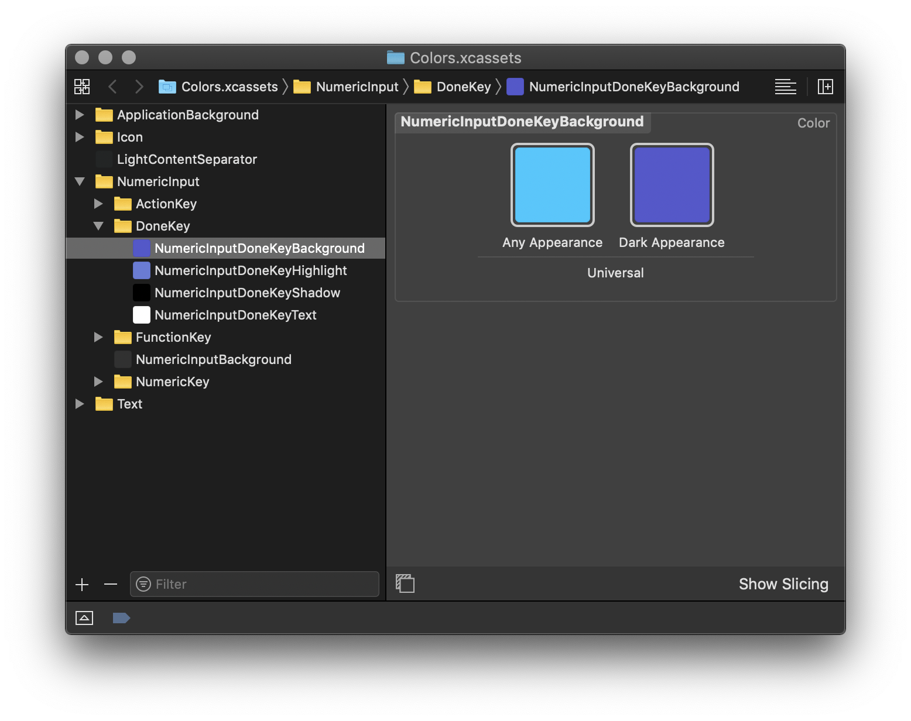

[](https://circleci.com/gh/nesium/xcode-color-assets)

# Xcode Color Assets

This project allows you to create Xcode Assets catalogs for your colors. Instead of tediously creating your named colors in Xcode's UI you can create a CSS-like document and have your Asset catalog generated programmatically. Specify colors in hex (with a twist, to allow specifying the alpha value in percent) and RGBA. Use variables for your colors and support dark mode. Finally, generate a corresponding Swift file to reference the created colors safely in your code.

Turn this…

```
// Basic colors
$white: #ffffff
$black: #000000
$black50: #000000 50%
$classic: (light: $black, dark: $white)

// Accent colors
$brightAccent: #5753CF
$mediumBright: rgba(25, 200, 255, 1)
$mediumBrightHighlight: #70D1FA

// Greys
$grey1: $black

// Declarations
Text {
  Primary: (light: #151618, dark: #E7E8EA)
  Secondary: (light: $grey1, dark: #85868A)
}

LightContentSeparator: (light: #F1F2F2, dark: #222525)

NumericInput {
  NumericKey {
    Background: (light: $white, dark: #434343)
    Highlight: (light: #C4CCDA, dark: #666666)
    Shadow: (light: #848587, dark: $black50 50%) // Apply alpha to variables
    Text: $classic
  }

  DoneKey {
    Background: (light: $mediumBright, dark: $brightAccent)
    Highlight: (light: $mediumBrightHighlight, dark: rgba(103, 122, 219, 1))
    Shadow: (light: #6E7073, dark: $black)
    Text: $classic
  }

  Background: (light: #D6D9DE 30%, dark: #313131 40%)
}
```

into this…



and also this…

```swift
// This file is automatically generated. Do not edit, your changes will be erased.

import UIKit

extension UIColor {
  enum Custom {
    static let LightContentSeparator = UIColor(named: "LightContentSeparator")!
    enum NumericInput {
      enum NumericKey {
        static let Background = UIColor(named: "NumericInputNumericKeyBackground")!
        static let Highlight = UIColor(named: "NumericInputNumericKeyHighlight")!
        static let Shadow = UIColor(named: "NumericInputNumericKeyShadow")!
        static let Text = UIColor(named: "NumericInputNumericKeyText")!
      }
      enum DoneKey {
        static let Background = UIColor(named: "NumericInputDoneKeyBackground")!
        static let Highlight = UIColor(named: "NumericInputDoneKeyHighlight")!
        static let Shadow = UIColor(named: "NumericInputDoneKeyShadow")!
        static let Text = UIColor(named: "NumericInputDoneKeyText")!
      }
      static let Background = UIColor(named: "NumericInputBackground")!
    }
    enum Text {
      static let Primary = UIColor(named: "TextPrimary")!
      static let Secondary = UIColor(named: "TextSecondary")!
    }
  }
}

```

### Installation via Homebrew

`brew install nesium/tools/xcode-color-assets`

### Usage

```
$ # Use xcode-color-assets SUBCOMMAND --help for more information
$ xcode-color-assets gen-assets colors.assetstyles -o Colors.xcassets --color-space display-p3
$ xcode-color-assets gen-swift colors.assetstyles -o UIColor+Custom.swift
```
