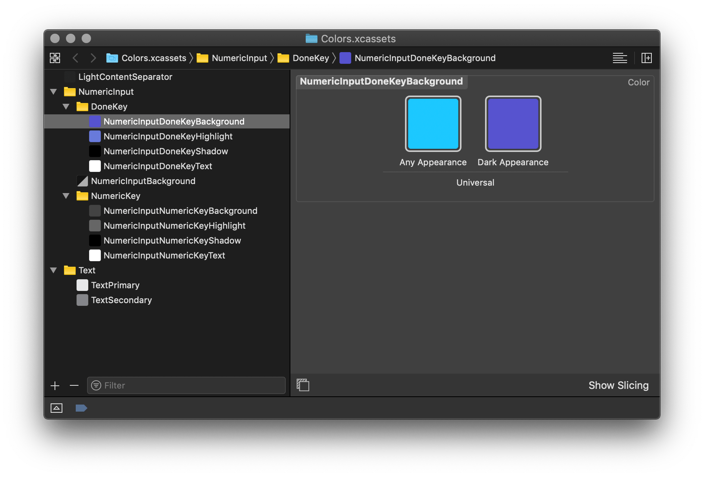

# Color Assets

Tired of creating Color Sets in Xcode?

Turn this…

```
white = #ffffff
black = #000000

darkAccent = #4B0FC6
brightAccent = #5753CF

mediumBright = #19C8FF
mediumBrightHighlight = #70d1fa

grey1 = #CACBCD

root {
  ApplicationBackground {
    Light: (light: $white, dark: #141517)
    Dark: (light: $darkAccent, dark: #0C0B0E)
  }

  Icon {
    Active: (light: $darkAccent, dark: $brightAccent)
    Inactive: (light: $grey1, dark: #50555C)
  }

  Text {
    Primary: (light: #151618, dark: #E7E8EA)
    Secondary: (light: #75767A, dark: #85868A)
  }

  LightContentSeparator: (light: #F1F2F2, dark: #222525)

  NumericInput {
    ActionKey {
      Background: (light: #ACB4BC, dark: #666666)
      Highlight: (light: $black, dark: #999999)
      Shadow: (light: #6E7073, dark: $black)
      Text: (light: $black, dark: $white)
    }

    DoneKey {
      Background: (light: $mediumBright, dark: $brightAccent)
      Highlight: (light: $mediumBrightHighlight, dark: #677ADB)
      Shadow: (light: #6E7073, dark: $black)
      Text: (light: $black, dark: $white)
    }

    FunctionKey {
      Background: (light: #73757B, dark: #232323)
      Highlight: (light: #29292F, dark: #434343)
      Shadow: (light: #454646, dark: $black)
      Text: (light: $white, dark: #CCCCCC)
    }

    NumericKey {
      Background: (light: $white, dark: #434343)
      Highlight: (light: #C4CCDA, dark: #666666)
      Shadow: (light: #848587, dark: $black)
      Text: (light: $black, dark: $white)
    }

    Background: (light: #D6D9DE, dark: #313131)
  }
}
```

into this…



> Caveat: This project is in the "works for me" state. There is basically no error handling at this point.
